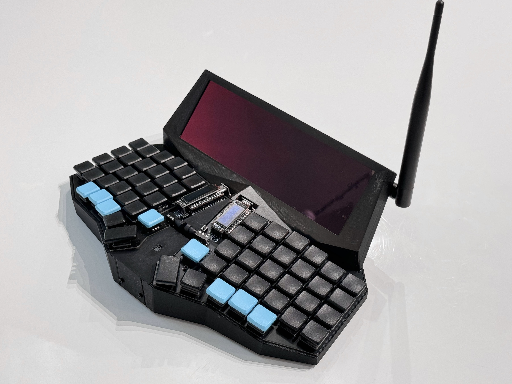
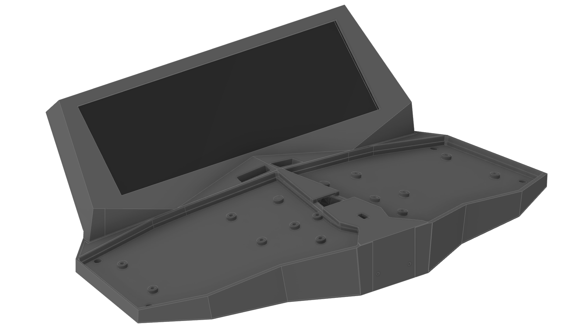
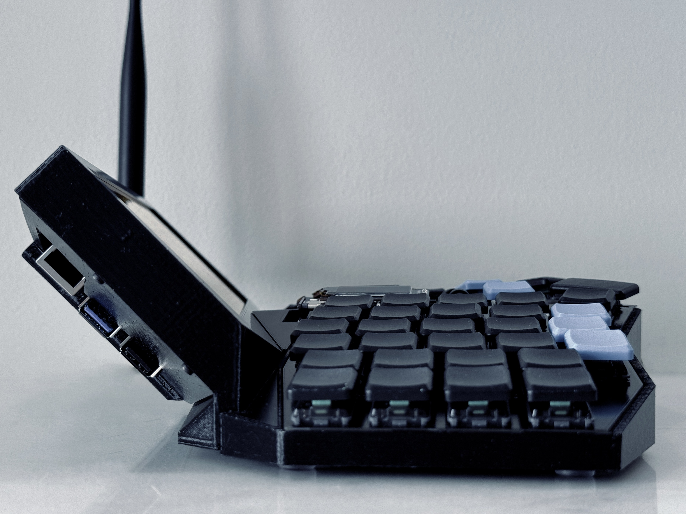
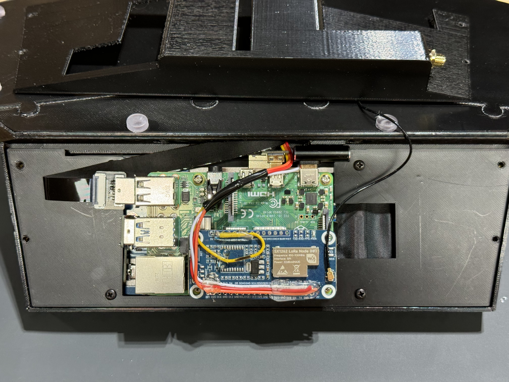
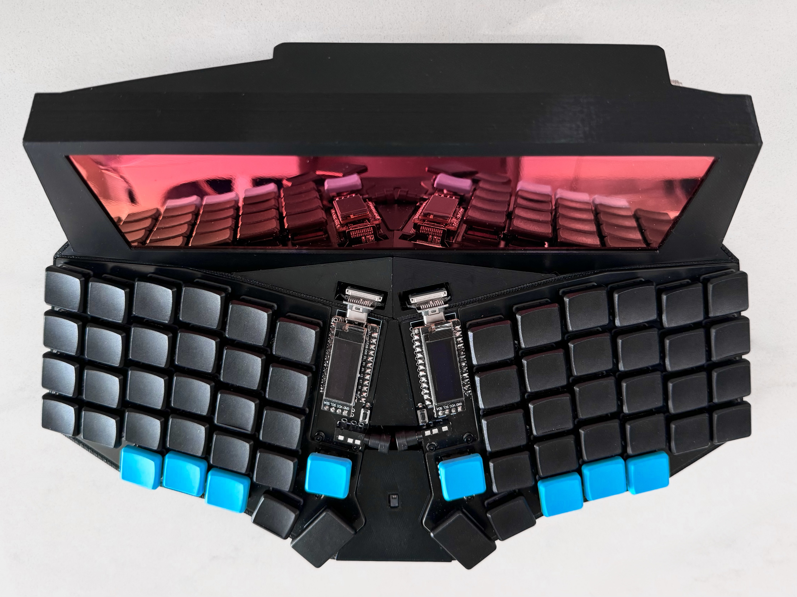

# vecdec

The vecdec is a versatile ergonomic computing device built in the style of a cyberdeck around a split ergonomic mechanical keyboard.  It was created because a laptop with this split keyboard, or any(?) split keyboard, does not exist today.

# Features
- Ergonomic split keyboard (sofle choc)
- LoRa radio for use with meshtastic
- Low power consumption
- Ability to use keyboard with an external device
- Relatively portable
- Easily expandable
- 3d printed case parts fit on Prusa MK3s bed

# Bill of Materials
## Keyboard
The parts below are deviations from Brian Low's build guide.
| part | description | link |
| --- | --- | --- |
| sofle choc RGB v2 | open source split ergonomic keyboard | https://brianlow.notion.site/Sofle-Choc-Build-Guide-c4bbbaece6e746f7a5956842af567e79 |
| ec12 rotary encoder (8.5mm shaft length) part # EC12E1220301 | lower profile than the EC11, but loses the click.  Press in the MBK keycap for a mechanical fit, but secure with cyanoacrylate (super) glue.  Alternatively, use a knob. | https://www.digikey.com/en/products/detail/alps-alpine/EC12E1220301/21721660 |
| Pro Micro (Elite-C) microcontroller | Can use a cheaper microcontroller but will likely have to modify the STL slightly | https://www.diykeyboards.com/parts/electronics/product/elite-c |
| female headers 2.54mm | These are lower profile and allow the Elite-C to sit slightly closer to the board | https://www.diykeyboards.com/parts/product/single-row-40pin-2-54mm-round-female-sip-socket-pin-header |
| male pins 10x.6mm | These thin pins are commonly used to connect LED strips and are the correct diameter for the low profile headers.  The pins need to be removed with pliers.  Place layer of painters tape above female headers, insert pins, place microcontroller on top, solder, then clip pin excess from top of microcontroller | https://www.amazon.com/50pcs-Black-Connector-Clutch-Adapter/dp/B074CDLB2H/ |
| TRRS audio cable | Ultra low profile right angle | https://www.amazon.com/Riipoo-3-5mm-AUX-Audio-Cable/dp/B07429HJRJ/ |

## Everything else
| part | description | link |
| --- | --- | --- |
| SX1262 hat | LoRa radio Pi hat for use with meshtastic | https://www.waveshare.com/sx1262-lorawan-hat.htm |
| u.FL to SMA connector | Minimal length required, approx 6" | u.FL to SMA connector |
| 915mHz antenna | Right angle antenna, can use antenna with up to 20mm thumb screw, which is most | |
| PAJ7620U2 (HiLetgo) | Gesture sensor, HiLetgo version used. Others may need modification. | https://www.amazon.com/HiLetgo-PAJ7620U2-Recognition-Detection-Recognize/ |
| 4 pin JST M+F connector | Any 4 pin connector is suitable, 1' in length for use in connecting the gesture sensor to sx1262 hat. | |
| Waveshare 7.9" 400x1280 touchscreen | Included instructions need updates, see below for modifications | https://www.waveshare.com/7.9inch-HDMI-LCD.htm |
| Right angle USB-C adapter | These vary slightly, the STL was designed for use with the linked version | https://www.amazon.com/AuviPal-Adapter-Connector-Extender-MacBook/dp/B0BNMDRWR6/ |
| Anker 733 Power Bank (GaNPrime PowerCore 65W) | Components as listed need a 5v 3a power supply, the Anker works very well | https://www.anker.com/products/a1651 |
| DIY USB-C to USB-A cable | .5m in length is sufficient, most available DIY connectors should work, but may require modifications to STL on USB-C side  | https://www.amazon.com/ChenYang-Type-C-Upward-Angled-Degree/dp/B096YCP762/ |
| Raspberry Pi 4 | Best to use with a heatsink, no fan required with this configuration  | |
| 2mm heatset nutserts | 4x for securing back shell to screen bezel, 2x for front plate | |
| M2x10 hex head fastener | Use with above heatset nutserts, 6x | |
| 4mm heatset nutserts | 2x for securing screen bezel to keyboard trays | |
| M4x20 hex head fasteners | Use with above heatset nutserts, 2x| |
| Rubber feet | STL holes are 5mm.  Feet are marketed as glass table top bumpers.  Optionally secure with CA glue. | https://www.amazon.com/Bumpers-Grippers-Adhesive-Furniture-Cabinet/dp/B0CL9Y6BJF/ |

# 3d Printing

- Print with the following flat surfaces facing down on the build plate: screen bezel face, keyboard bottom, veneers, top of back shell.
- The only part requiring supports is the back shell, but the screen bezel optionally can use supports at the cable pass through.  Tree/organic supports work well.
- Secure the keyboard trays and screen bezel with heatset nutserts and hex head screws
- Tolerance on some parts might need adjustment, .25mm was sufficient for a comfortable press fit
- Secure thin veneer pieces with cyanoacrylate glue

# Software
All of the software pieces are fairly straight forward, but the provided screen instructions are out of date.  The PAJ7620U2 works out of the box with common python libraries, and the SX1262 hat has native meshtastic support.

### Waveshare screen configuration
- TODO

### PAJ7620U2 gesture sensor
- TODO

### sx1262 hat & meshtastic
- TODO

# Miscellaneous
## User Interface
A tiling window manager such as i3 or sway that relies heavily on keyboard shortcuts is ideal, given that there is no external pointing device.  The touch screen fills the gap when a pointing device is absolutely required, and the rotary encoders and gesture sensor can be used for easy page up / page down navigation, providing a few additional options.

## Photos

Side view with available ports exposed

View with rear shell and antenna nub removed, hat wiring strain relief with hot melt glue, additional wiring for i2c gesture sensor.  The PAJ7620U2 gesture sensor JST connector should be soldered directly to the exposed pins on the sx1262 hat.  The hat should use the most shallow female headers included with the kit.  This method minimizes bulk at the back of the case.

3m privacy filter visible, though with touch screen usage the filter will eventually stick to the screen resulting in unsightly air bubbles.  Need a new solution here.

This work is licensed under a
[Creative Commons Attribution-NonCommercial-ShareAlike 4.0 International License][cc-by-nc-sa].

[![CC BY-NC-SA 4.0][cc-by-nc-sa-image]][cc-by-nc-sa]

[cc-by-nc-sa]: http://creativecommons.org/licenses/by-nc-sa/4.0/
[cc-by-nc-sa-image]: https://licensebuttons.net/l/by-nc-sa/4.0/88x31.png
[cc-by-nc-sa-shield]: https://img.shields.io/badge/License-CC%20BY--NC--SA%204.0-lightgrey.svg
