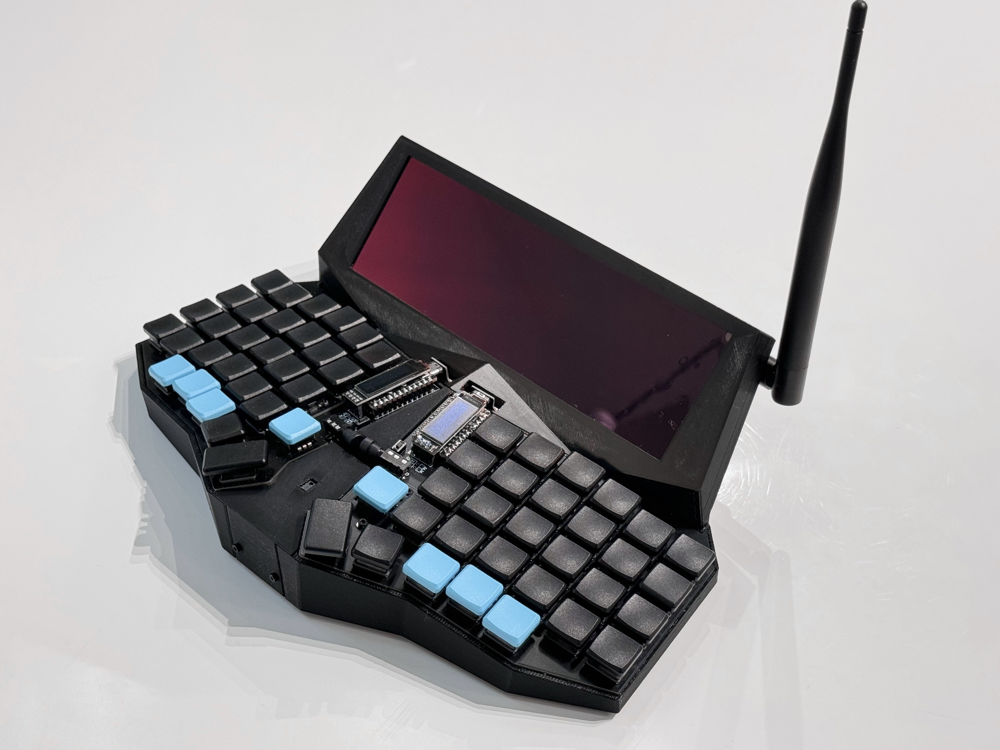
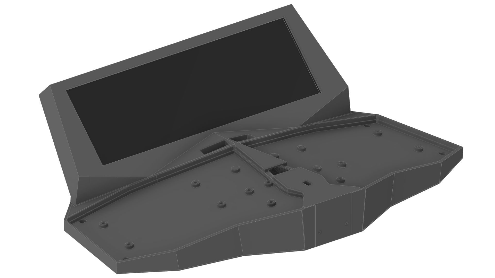
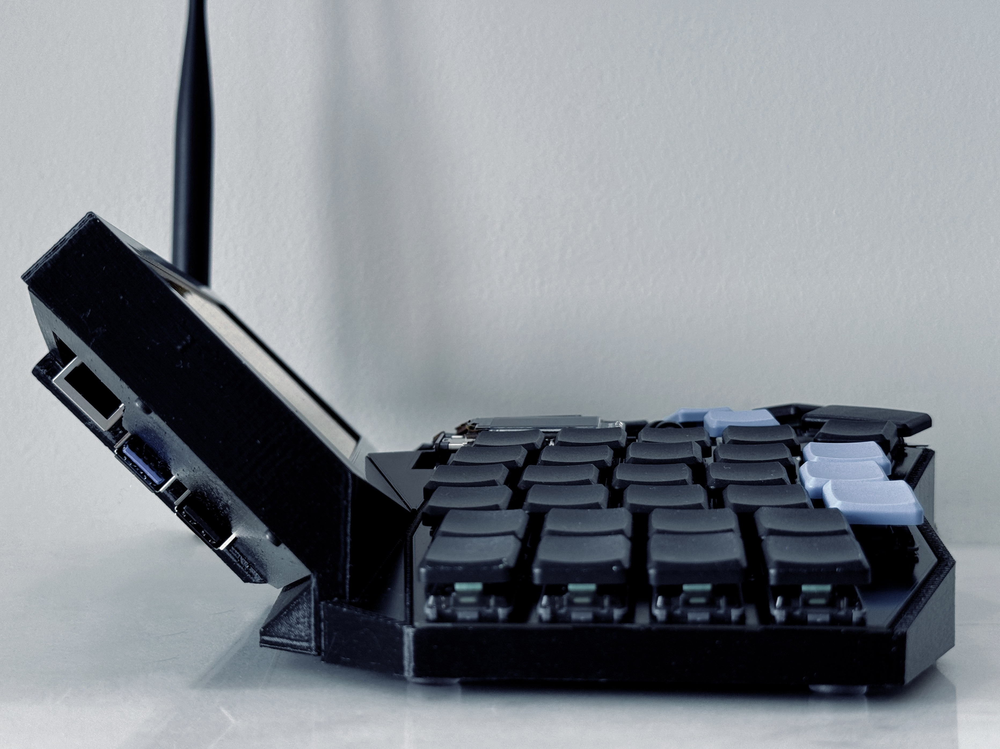
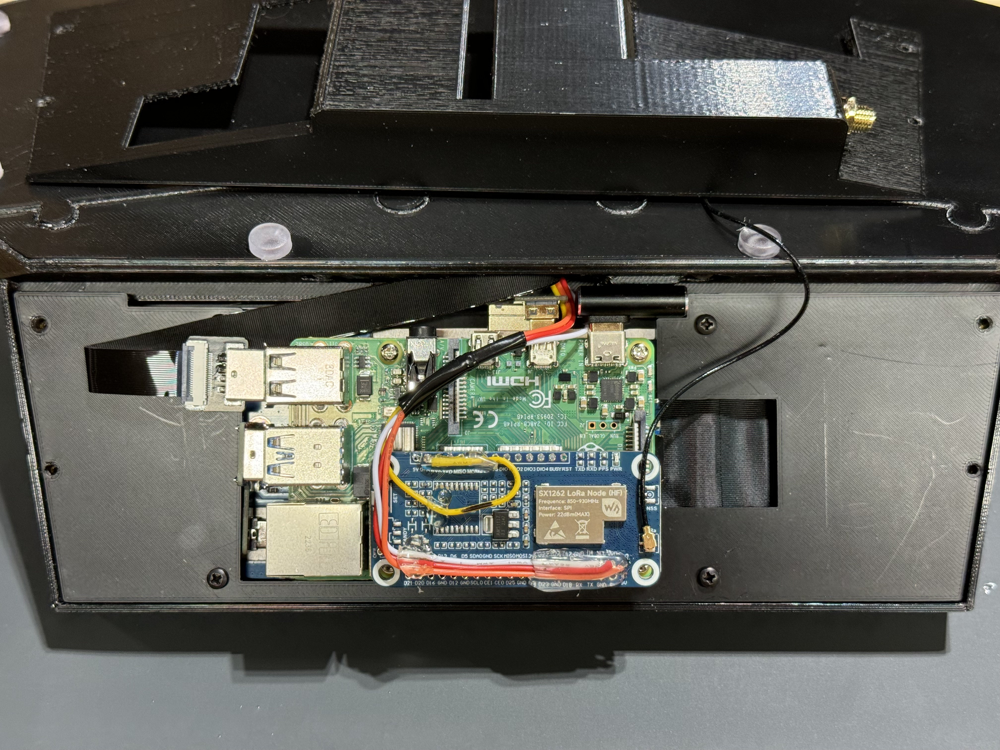
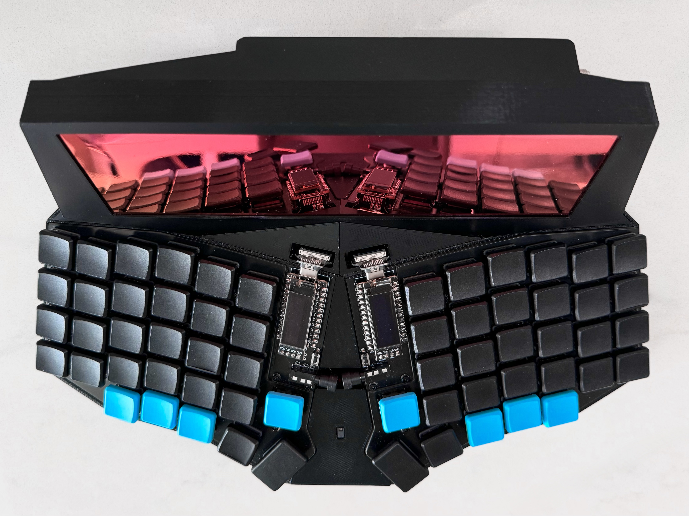

# vecdec

The vecdec is a versatile ergonomic computing device built in the style of a cyberdeck around a split ergonomic mechanical keyboard.  It was created because a laptop with this split keyboard or any split keyboard, did not exist.  The vecdec in computing form uses relatively low power and is easily expandable with areas for mounting breakout boards internally and SAO ports externally.  It can also be used as an external keyboard.

**v**ersatile
**e**rgonomic
**c**omputing
**de**vi**c**e

*vecdec 1.0, highly portable Pi-based cyberdeck with split keyboard and meshtastic radio*

*vecdec 1.1, with larger screen, trackball, USB and SAO ports and retaining meshtastic radio*

# Release Notes
### v1.0
This is the first release with a compact candybar screen and gesture sensor.  After using it quite a bit for almost a year, it's great for note taking, light hacking and dev work, aided greatly by i3wm.  Web browsing is good enough, but video is not ideal given the proliferation of vertical video.  The Anker external USB battery pack is more than sufficient for hours of note taking.  A case sleeve ensures it is easy to slip in and out of a backpack.

Hackaday features an excellent write-up on this version, thanks to Tom Nardi: [The Vecdec Cyberdeck Is More Than A Pretty Case](https://hackaday.com/2024/11/19/the-vecdec-cyberdeck-is-more-than-a-pretty-case/)

### v1.1
This release includes a bigger screen to help address the drawbacks of 1.0's screen resolution.  The gesture sensor was replaced with a small trackball and text selection is  now more precise than using the touchscreen.  For meshtastic, the sx1262 hat was replaced in favor of the MeshAdv mini hat.  MeshAdv mini has the E22 chip, GPS and Qwiic connectors.

Two SAO ports were added, which can be used to daisy chain external i2c breakouts for rapid prototyping, or of course, for SAOs.  These are easier to connect thanks to a tiny Qwiic SAO board or if using the MeshAdv hat, directly from the hat.

The keyboard tray was revised, and the keyboard now sits on rubber isolators similar to those used on UAVs, quieting the typing experience.  The isolators required the trays to be a few mm deeper.  The trays now have provisions for 4 USB ports since the Pi's ports are now concealed.  One port is connected to the left keyboard half enabling use as an external keyboard.  The three remaining are connected to the Pi with DIY USB ribbon cables and connectors.

To connect the vecdec as an external keyboard, the top left most USB port is used.  To use it as a standalone cyberdeck, power is supplied to a rear USB-C port.

# Specs

| Spec | Version |
| --- | --- |
| Split keyboard (sofle choc) | all |
| LoRa radio (meshtastic) | all |
| 3d printable on 250mm x 210mm bed | all |
| 400x1280 screen | all |
| 1280x800 screen | 1.1 |
| SAO ports with i2c (2x) | 1.1 |
| Trackball | 1.1 |
| i2c hub | 1.1 |
| Front USB ports (2x) | 1.1 |
| Side USB ports (2x) | 1.1 |
| Rubber keyboard isolation | 1.1 |
| 400x1280 screen | 1.0 |
| Gesture sensor | 1.0 |

# Bill of Materials

## Components

| part | description | link |
| --- | --- | --- |
| SAO adapter | Created a custom SAO adapter for connecting to Pi i2c bus, KiCad files in repo.  Does not support full SAO v1.69bis spec, but has 3.3v, GND, i2c. | [Qwiic SAO KiCad](kicad/) |
| i2c hub | Qwiic hub for connecting i2c devices. | https://www.adafruit.com/product/5625 |
| LoRa hat | LoRa radio hat for use with meshtastic.  v1.0 used the sx1262 based board from waveshare, and while Adafruit's hat also works, the MeshAdv hat is the most fully featured and supported.  The i2c qwiic connectors are also convenient. | https://github.com/chrismyers2000/MeshAdv-Mini |
| u.FL to SMA connector | Minimal length required, approx 6" | u.FL to SMA connector |
| 915mHz antenna | Right angle antenna, can use antenna with up to 20mm thumb screw, which is most | |
| PAJ7620U2 (HiLetgo) | Gesture sensor, HiLetgo version used. Others may need modification. | https://www.amazon.com/HiLetgo-PAJ7620U2-Recognition-Detection-Recognize/ |
| Trackball breakout (Pimoroni) | i2c trackball with RGBW LED, x/y and click | https://shop.pimoroni.com/products/trackball-breakout |
| 4 pin JST M+F connector | Any 4 pin connector is suitable, 1' in length for use in connecting the gesture sensor to sx1262 hat. | |
| Waveshare 7.9" 400x1280 touchscreen | Included instructions need updates, see below for modifications | https://www.waveshare.com/7.9inch-HDMI-LCD.htm |
| Waveshare 8" 1280x800 touchscreen | Included instructions need updates, see below for modifications | https://www.waveshare.com/product/displays/lcd-oled/lcd-oled-1/8inch-dsi-lcd-c.htm |
| Right angle USB-C adapter | These vary slightly, the STL was designed for use with the linked version | https://www.amazon.com/AuviPal-Adapter-Connector-Extender-MacBook/dp/B0BNMDRWR6/ |
| Anker 733 Power Bank (GaNPrime PowerCore 65W) | Components as listed need a 5v 3a power supply, the Anker works very well | https://www.anker.com/products/a1651 |
| DIY USB-C to USB-A cable | .5m in length is sufficient, most available DIY connectors should work, but may require modifications to STL on USB-C side  | https://www.amazon.com/ChenYang-Type-C-Upward-Angled-Degree/dp/B096YCP762/ |
| Raspberry Pi 4 | Best to use with a heatsink, no fan required with this configuration  | |
| 2mm heatset nutserts | 4x for securing back shell to screen bezel, 2x for front plate | |
| M2x10 hex head fastener | Use with above heatset nutserts, 6x | |
| 4mm heatset nutserts | 2x for securing screen bezel to keyboard trays | |
| M4x12 hex head fasteners | Use with above heatset nutserts, 2x| |
| Rubber feet | STL holes are 5mm.  Feet are marketed as glass table top bumpers.  Optionally secure with CA glue.  These have been omitted from 1.1 and unless are extra shallow, will not fit in the case. | https://www.amazon.com/Bumpers-Grippers-Adhesive-Furniture-Cabinet/dp/B0CL9Y6BJF/ |
| USB C female to USB A female | Adds USB-C port to keyboard half for an easier connection to an external device | https://www.amazon.com/Duttek-Adapter-Female-Connector-Compatible/dp/B08JHYKF3T
| M2 rubber standoffs | Acoustic isolation that dampens the case sounds when clicked | https://www.amazon.com/FPVDrone-Anti-Vibration-Mounting-Standoffs-Controller/dp/B07RZSX647/

## Keyboard

The parts below are deviations from Brian Low's build guide.
| part | description | link |
| --- | --- | --- |
| sofle choc RGB v2 | open source split ergonomic keyboard | https://brianlow.notion.site/Sofle-Choc-Build-Guide-c4bbbaece6e746f7a5956842af567e79 |
| ec12 rotary encoder (8.5mm shaft length) part # EC12E1220301 | lower profile than the EC11, but loses the click.  Press in the MBK keycap for a mechanical fit, but secure with cyanoacrylate (super) glue.  Alternatively, use a knob. | https://www.digikey.com/en/products/detail/alps-alpine/EC12E1220301/21721660 |
| Pro Micro (Elite-C) microcontroller | Can use a cheaper microcontroller but will likely have to modify the STL slightly | https://www.diykeyboards.com/parts/electronics/product/elite-c |
| female headers 2.54mm | These are lower profile and allow the Elite-C to sit slightly closer to the board | https://www.diykeyboards.com/parts/product/single-row-40pin-2-54mm-round-female-sip-socket-pin-header |
| male pins 10x.6mm | These thin pins are commonly used to connect LED strips and are the correct diameter for the low profile headers.  The pins need to be removed with pliers.  Place layer of painters tape above female headers, insert pins, place microcontroller on top, solder, then clip pin excess from top of microcontroller | https://www.amazon.com/50pcs-Black-Connector-Clutch-Adapter/dp/B074CDLB2H/ |
| TRRS audio cable | Ultra low profile right angle | https://www.amazon.com/Riipoo-3-5mm-AUX-Audio-Cable/dp/B07429HJRJ/ |

# 3d Printing

### Version 1.1

### Version 1.0

- Print with the following flat surfaces facing down on the build plate: screen bezel face, keyboard bottom, veneers, top of back shell.
- The only part requiring supports is the back shell, but the screen bezel optionally can use supports at the cable pass through.  Tree/organic supports work well.
- Secure the keyboard trays and screen bezel with heatset nutserts and hex head screws
- Tolerance on some parts might need adjustment depending on the filament and printer used
- Secure thin veneer pieces with cyanoacrylate glue

# SAO Ports
The [SAO](https://hackaday.com/2019/03/20/introducing-the-shitty-add-on-v1-69bis-standard/) standard has gone through several revisions over the years, and the vecdec doesn't implement any of them to spec, holding true to the S in SAO.  Instead, only the 3.3v, GND and i2c pins are connected, not GPIO.  The goal was to make a simple, yet entertaining method to expose the i2c bus externally for quick prototyping with the many of the sensors that use the Qwiic connector standard.  By adding a Qwiic port to your SAO, you can then connect any Qwiic device to the vecdec without opening the case.

# Software

All of the software pieces are fairly straight forward, but the provided screen instructions are out of date.  The PAJ7620U2 works out of the box with common python libraries, and the MeshAdv mini hat has native meshtastic support.

### Waveshare screen configuration

v1.0 display: https://www.waveshare.com/wiki/7.9inch_HDMI_LCD

v1.1 display: https://www.waveshare.com/wiki/8inch_DSI_LCD_(C)

### PAJ7620U2 gesture sensor

The example code at https://github.com/DFRobot/DFRobot_PAJ7620U2 has requisite register definitions use the sensor.

### MeshAdv mini

Follow the installation guide at https://github.com/chrismyers2000/MeshAdv-Mini.  No changes were needed at the time of writing.

### Pimoroni trackball

Use the example code at https://github.com/pimoroni/trackball-python, launch at either X startup or after login.

# Miscellaneous

## User Interface

A tiling window manager such as i3 or sway that relies heavily on keyboard shortcuts is ideal given the mouse / touch options.

Here is how the human interface devices seem to best, but YMMV:
| component | use |
| --- | --- |
| touchscreen | scrolling PDFs, web pages |
| trackball | precise text selection, but map keys for mouse buttons (i.e. layer key + v, c, x for left, middle and right click)
| rotary encoder L | page up/down |
| rotary encoder R | volume up/down |
| gesture sensor | really just a party trick, it's accurate enough to be fun, but not 100% reliable |

## Photos

### vecdec 1.1

vecdec 1.1 in 3d printed case sleeve

vecdec 1.1 in 3d printed case sleeve, resting in backpack.

### vecdec 1.0

Side view with available ports exposed

View with rear shell and antenna nub removed, hat wiring strain relief with hot melt glue, additional wiring for i2c gesture sensor.  The PAJ7620U2 gesture sensor JST connector should be soldered directly to the exposed pins on the sx1262 hat.  The hat should use the most shallow female headers included with the kit.  This method minimizes bulk at the back of the case.

3m privacy filter visible, though with touch screen usage the filter will eventually stick to the screen resulting in unsightly air bubbles.  Need a new solution here.

This work is licensed under a
[Creative Commons Attribution-NonCommercial-ShareAlike 4.0 International License][cc-by-nc-sa].

[![CC BY-NC-SA 4.0][cc-by-nc-sa-image]][cc-by-nc-sa]

[cc-by-nc-sa]: http://creativecommons.org/licenses/by-nc-sa/4.0/
[cc-by-nc-sa-image]: https://licensebuttons.net/l/by-nc-sa/4.0/88x31.png
[cc-by-nc-sa-shield]: https://img.shields.io/badge/License-CC%20BY--NC--SA%204.0-lightgrey.svg
